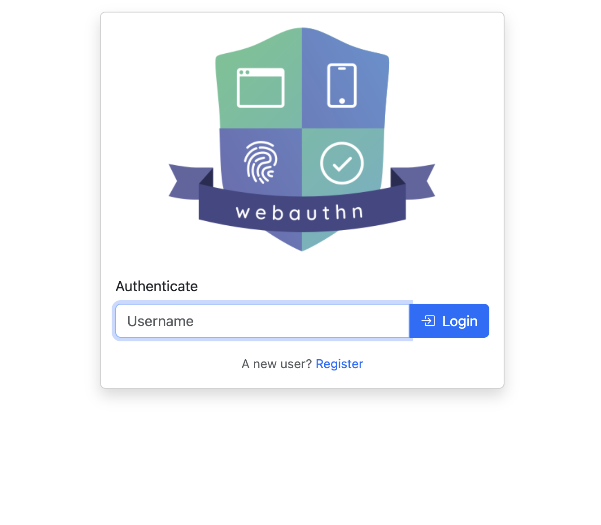
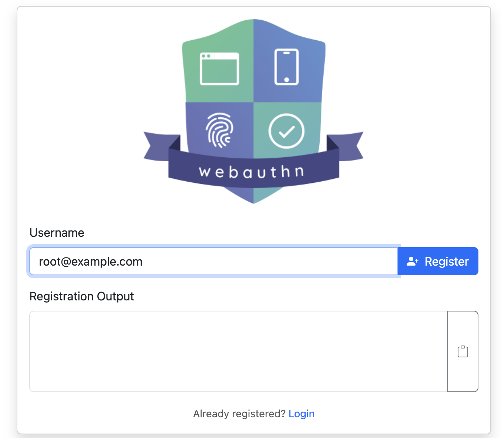

# WebAuthn Proxy

A standalone reverse-proxy for passwordless Webauthn authentication. Supports hardware authenticators like Yubikey, Touch ID etc.

| Login | Registration |
|:---:|:---:|
|  |  |

## Quick Start

### Using Docker (Recommended)

```bash
# Run the proxy
docker run --rm -ti -p 8080:8080 quiq/webauthn_proxy:latest

# With custom config
docker run --rm -ti -p 8080:8080 -v /path/to/config:/opt/config:ro quiq/webauthn_proxy:latest

# Generate cookie secret for credentials.yml
docker run --rm --log-driver=none quiq/webauthn_proxy:latest -generate-secret
```

### Using Go

```bash
# Run directly
go run .

# Build
go build -o webauthn_proxy . && chmod +x webauthn_proxy
./webauthn_proxy -v
```

## Setup

1. **Configuration**: Create `config/config.yml` with your settings (see [Configuration](#configuration))
2. **Credentials**: Start with an empty `config/credentials.yml` file
3. **Register**: Visit `http://localhost:8080/webauthn/register`
4. **Add User**: Copy the generated credential to `credentials.yml` and restart
5. **Login**: Visit `http://localhost:8080/webauthn/login`

## Configuration

### Required Options

```yaml
rpDisplayName: "MyCompany"    # Your organization name
rpID: "example.com"           # Your domain
```

### Common Options

- `serverAddress`: Listen address (default: `0.0.0.0`)
- `serverPort`: Listen port (default: `8080`)
- `rpOrigins`: Allowed origins (default: all)
- `testMode`: Allow immediate login after registration (default: `false`)
- `cookieSecure`: Enable for HTTPS (default: `false`)
- `sessionSoftTimeoutSeconds`: Session timeout (default: 28800 / 8 hours)

[Full configuration options](config/config.yml)

## Integration

### NGinx

```nginx
location / {
    auth_request /webauthn/auth;
    error_page 401 = /webauthn/login?redirect_url=$uri;
    # ...
}

location /webauthn/ {
    proxy_set_header X-Forwarded-Proto $scheme;
    proxy_set_header Host $host;
    proxy_pass http://127.0.0.1:8080;
}
```

### OpenResty (with OAuth2 Proxy)

```nginx
location / {
    auth_request /oauth2/auth;
    auth_request_set $email $upstream_http_x_auth_request_email;
    error_page 401 = /oauth2/start?rd=$uri;
    access_by_lua_block {
        local http = require "resty.http"
        local h = http.new()
        h:set_timeout(5 * 1000)
        local url = "http://127.0.0.1:8080/webauthn/auth"
        ngx.req.set_header("X-Forwarded-Proto", ngx.var.scheme)
        ngx.req.set_header("Host", ngx.var.host)
        local res, err = h:request_uri(url, {method = "GET", headers = ngx.req.get_headers()})
        if err or not res or res.status ~= 200 then
            ngx.redirect("/webauthn/login?redirect_url=" .. ngx.var.request_uri .. "&default_username=" .. ngx.var.email)
            ngx.exit(ngx.HTTP_OK)
        end
    }
    # ...
}

location /webauthn/ {
    proxy_set_header X-Forwarded-Proto $scheme;
    proxy_set_header Host $host;
    proxy_pass http://127.0.0.1:8080;
}
```

## Learn More

- [What is Webauthn?](https://webauthn.guide/)
- [Docker Hub](https://hub.docker.com/r/quiq/webauthn_proxy/tags)
